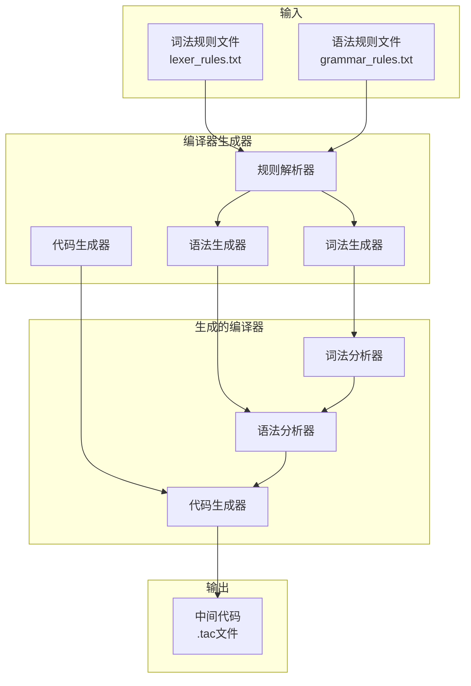
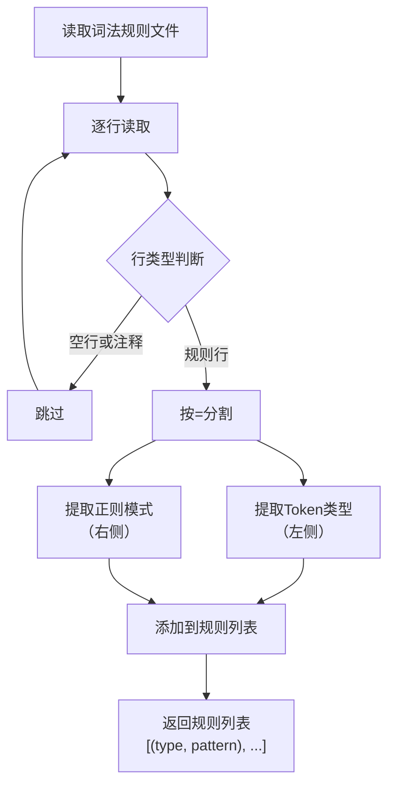
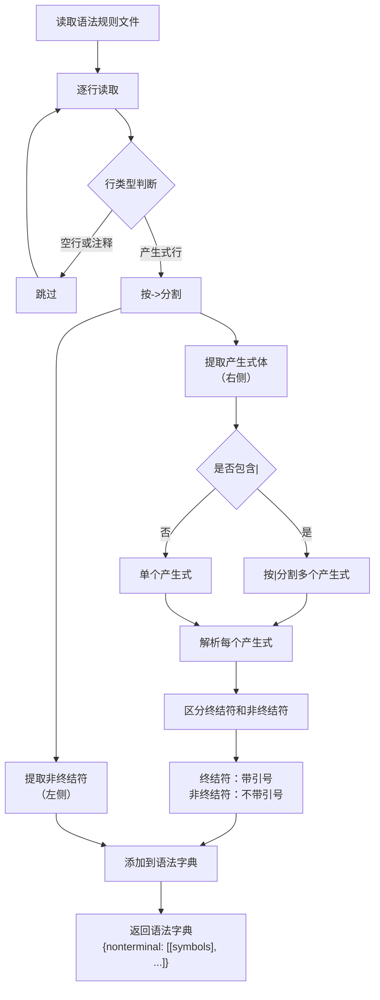
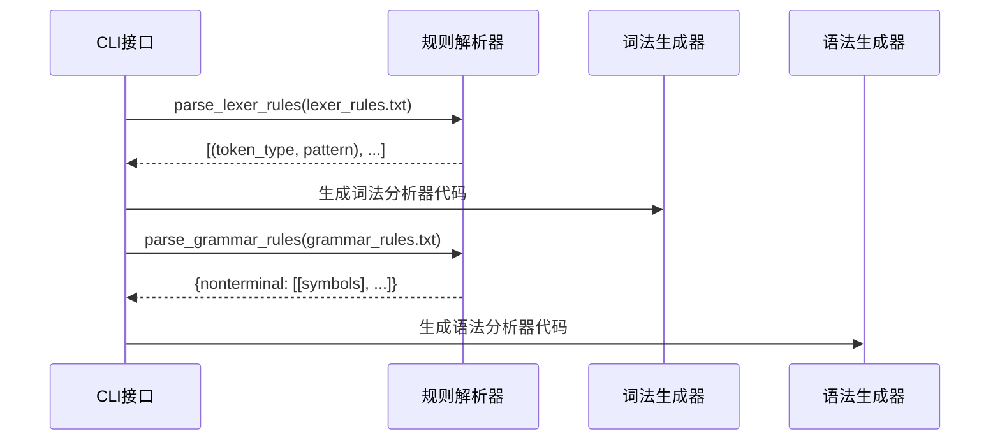

# 编译器-编译器项目 PPT 内容文档

## 第一部分：项目介绍（2分钟）

### 1.1 项目概述

**标题**：编译器-编译器（Compiler-Compiler）

**项目定位**：能够根据形式化的词法规则和语法规则自动生成完整编译器的工具

### 1.2 选择的语法和词法形式

**词法规则形式**：**正则表达式（Regular Expression）**

- 格式：`TOKEN_TYPE = regex_pattern`
- 支持标准正则表达式语法
- 示例：
  ```
  ID = [a-zA-Z_][a-zA-Z0-9_]*
  NUM = [0-9]+
  PLUS = \+
  ```

**语法规则形式**：**BNF范式（Backus-Naur Form）**

- 格式：`NonTerminal -> production1 | production2`
- 终结符用单引号包围（如 `'ID'`）
- 非终结符直接写名字（如 `Expr`）
- 示例（LL(1)文法）：
  ```
  Expr -> Term ExprTail
  ExprTail -> 'PLUS' Term ExprTail | 'MINUS' Term ExprTail | 
  Term -> Factor TermTail
  ```

**选择理由**：
- ✅ 正则表达式：标准、通用，易于理解和实现
- ✅ BNF范式：经典、规范，符合编译原理课程要求
- ✅ LL(1)文法：消除左递归和左公因子，适合递归下降分析

**测试使用的语言**：**PL/0子集语言**

我们使用PL/0子集语言进行测试，这是编译原理课程的经典教学语言。

**PL/0词法规则特点**：
- 关键字：`var`, `if`, `while`, `read`, `write`
- 标识符：字母、数字、下划线
- 数字：整数
- 运算符：算术运算符（+, -, *, /）、比较运算符（<, <=, >, >=, ==, <>）

**PL/0语法规则特点**：
- 程序结构：`Program -> DeclList StmtList`
- 变量声明：`VarDecl -> 'VAR' IDList 'SEMI'`
- 控制流：`IfStmt`, `WhileStmt`
- 表达式：使用LL(1)文法，消除左递归（`Expr -> Term ExprTail`）

**测试程序示例**：
```pl0
VAR x, y;
x = 10;
y = 20;
IF (x < y) {
    WRITE(x + y);
}
```

### 1.3 系统功能概述

**核心功能**：


**主要功能模块**：

1. **编译器生成**
   - 从规则文件自动生成词法分析器
   - 从规则文件自动生成语法分析器
   - 组合生成完整的编译器代码

2. **源代码编译**
   - 词法分析：将源代码转换为Token流
   - 语法分析：构建抽象语法树（AST）
   - 代码生成：生成三地址中间代码

3. **工具支持**
   - 命令行接口（CLI）
   - 批量编译功能
   - 测试框架支持

### 1.4 系统架构图



### 1.5 项目亮点

- ✅ **自动化生成**：从规则文件到完整编译器
- ✅ **语法制导翻译**：一遍扫描完成编译
- ✅ **LL(1)文法支持**：自动消除左递归和左公因子
- ✅ **模块化设计**：各模块独立，易于维护和扩展

---

## 第二部分：规则解析器实现（2.5分钟）

### 2.1 规则解析器概述

**功能定位**：规则解析器是编译器生成器的入口模块，负责将文本格式的规则文件转换为Python数据结构，供后续的生成器使用。

**核心作用**：
- 解析词法规则文件，提取Token类型和正则表达式模式
- 解析语法规则文件，提取非终结符和产生式
- 验证规则格式的正确性

### 2.2 词法规则解析

**输入格式**：

词法规则文件（`lexer_rules.txt`）采用 `TOKEN_TYPE = regex_pattern` 格式：

```
# PL/0子集语言的词法规则

# 关键字
VAR = var
IF = if
WHILE = while
READ = read
WRITE = write

# 标识符（在关键字之后检查）
ID = [a-zA-Z_][a-zA-Z0-9_]*

# 数字
NUM = [0-9]+

# 运算符
PLUS = \+
MINUS = -
MUL = \*
DIV = /
ASSIGN = =
```

**处理流程**：



**输出格式**：

返回 `List[Tuple[str, str]]`，每个元组包含 `(token_type, regex_pattern)`：

```python
[
    ('VAR', 'var'),
    ('IF', 'if'),
    ('WHILE', 'while'),
    ('ID', '[a-zA-Z_][a-zA-Z0-9_]*'),
    ('NUM', '[0-9]+'),
    ('PLUS', '\\+'),
    ('MINUS', '-'),
    ...
]
```

**关键实现**：
- `src/frontend/rule_parser.py:22-60` - `parse_lexer_rules()` 方法

**处理细节**：
- 支持 `#` 开头的注释行
- 自动跳过空行
- 使用 `=` 作为分隔符，支持转义字符
- 自动去除首尾空白字符

### 2.3 语法规则解析

**输入格式**：

语法规则文件（`grammar_rules.txt`）采用BNF格式：

```
# PL/0子集语言的语法规则 (LL(1) 优化版)

# 程序结构
Program -> DeclList StmtList

# 声明列表：消除左公因子
DeclList -> VarDecl DeclListTail | 
DeclListTail -> VarDecl DeclListTail | 

# 变量声明
VarDecl -> 'VAR' IDList 'SEMI'

# 标识符列表：消除左公因子
IDList -> 'ID' IDListTail
IDListTail -> 'COMMA' 'ID' IDListTail | 

# 表达式：消除左递归
Expr -> Term ExprTail
ExprTail -> 'PLUS' Term ExprTail | 'MINUS' Term ExprTail | 

# 项：消除左递归
Term -> Factor TermTail
TermTail -> 'MUL' Factor TermTail | 'DIV' Factor TermTail | 

# 因子
Factor -> 'NUM' | 'ID' | 'LPAREN' Expr 'RPAREN'
```

**处理流程**：



**输出格式**：

返回 `Dict[str, List[List[str]]]`，键为非终结符，值为产生式列表：

```python
{
    'Program': [
        ['DeclList', 'StmtList']
    ],
    'DeclList': [
        ['VarDecl', 'DeclListTail'],
        []  # 空产生式
    ],
    'DeclListTail': [
        ['VarDecl', 'DeclListTail'],
        []
    ],
    'VarDecl': [
        ["'VAR'", 'IDList', "'SEMI'"]
    ],
    'Expr': [
        ['Term', 'ExprTail']
    ],
    'ExprTail': [
        ["'PLUS'", 'Term', 'ExprTail'],
        ["'MINUS'", 'Term', 'ExprTail'],
        []  # 空产生式
    ],
    'Factor': [
        ["'NUM'"],
        ["'ID'"],
        ["'LPAREN'", 'Expr', "'RPAREN'"]
    ],
    ...
}
```

**关键实现**：
- `src/frontend/rule_parser.py:62-117` - `parse_grammar_rules()` 方法
- `src/frontend/rule_parser.py:119-163` - `_parse_symbols()` 辅助方法

**处理细节**：
- 支持 `#` 开头的注释行
- 自动跳过空行
- 支持 `|` 分隔的多个产生式
- 自动识别终结符（带单引号）和非终结符（不带引号）
- 支持空产生式（用空列表 `[]` 表示）

### 2.4 规则解析示例

**完整示例：从文件到数据结构**

**输入文件1**：`lexer_rules.txt`
```
ID = [a-zA-Z_][a-zA-Z0-9_]*
NUM = [0-9]+
PLUS = \+
```

**输入文件2**：`grammar_rules.txt`
```
Expr -> Term ExprTail
ExprTail -> 'PLUS' Term ExprTail | 
Term -> 'NUM' | 'ID'
```

**解析过程**：

```python
# 1. 解析词法规则
lexer_rules = RuleParser.parse_lexer_rules('lexer_rules.txt')
# 结果：
# [
#     ('ID', '[a-zA-Z_][a-zA-Z0-9_]*'),
#     ('NUM', '[0-9]+'),
#     ('PLUS', '\\+')
# ]

# 2. 解析语法规则
grammar_rules = RuleParser.parse_grammar_rules('grammar_rules.txt')
# 结果：
# {
#     'Expr': [['Term', 'ExprTail']],
#     'ExprTail': [
#         ["'PLUS'", 'Term', 'ExprTail'],
#         []
#     ],
#     'Term': [
#         ["'NUM'"],
#         ["'ID'"]
#     ]
# }
```

**数据结构用途**：

- **词法规则列表** → 传递给词法生成器，用于构建DFA
- **语法规则字典** → 传递给语法生成器，用于构建LL(1)分析表

### 2.5 规则解析器在系统中的作用

**在编译器生成流程中的位置**：



**关键特点**：
- ✅ **格式灵活**：支持注释和空行，提高可读性
- ✅ **容错处理**：自动跳过无效行，不会因格式问题崩溃
- ✅ **数据结构清晰**：输出格式便于后续生成器使用
- ✅ **易于扩展**：可以轻松添加新的规则格式支持

---

## PPT制作建议

### 幻灯片结构建议（总计约4.5分钟）

1. **第1页：项目标题**
   - 编译器-编译器（Compiler-Compiler）
   - 项目定位

2. **第2页：语法和词法形式**
   - 词法规则：正则表达式（示例）
   - 语法规则：BNF范式（示例，LL(1)）
   - PL/0测试语言说明

3. **第3页：系统功能概述**
   - 核心功能模块
   - 系统架构图（mermaid）

4. **第4页：规则解析器 - 词法规则解析**
   - 输入输出示例
   - 处理流程图（mermaid）

5. **第5页：规则解析器 - 语法规则解析**
   - 输入输出示例
   - 处理流程图（mermaid）

6. **第6页：规则解析器 - 完整示例**
   - 从文件到数据结构的转换示例
   - 在系统中的作用

7. **第7页：总结**
   - 项目亮点
   - 规则解析器的关键作用

### 图表使用建议

- **系统架构图**：展示整体结构（第3页）
- **词法规则解析流程图**：展示处理流程（第4页）
- **语法规则解析流程图**：展示处理流程（第5页）
- **序列图**：展示规则解析器在系统中的作用（第6页）

### 时间分配建议

- **项目介绍**：2分钟
  - 项目概述：0.3分钟
  - 语法和词法形式：0.7分钟
  - 系统功能概述：0.5分钟
  - 项目亮点：0.5分钟

- **规则解析器实现**：2.5分钟
  - 规则解析器概述：0.3分钟
  - 词法规则解析：0.8分钟
  - 语法规则解析：0.8分钟
  - 完整示例和系统作用：0.6分钟

**总计**：约4.5分钟（可根据实际情况调整）
