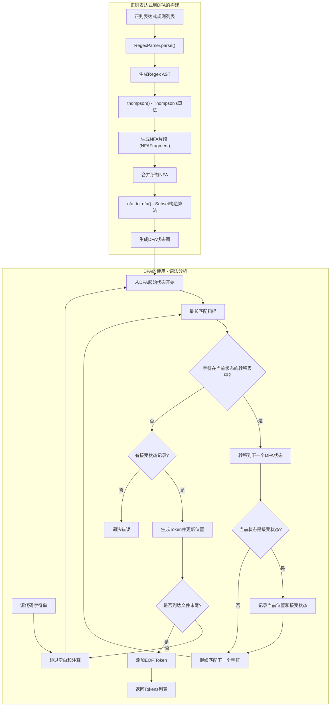
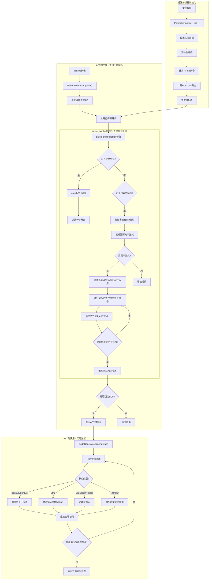
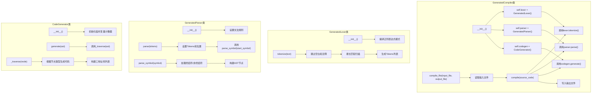
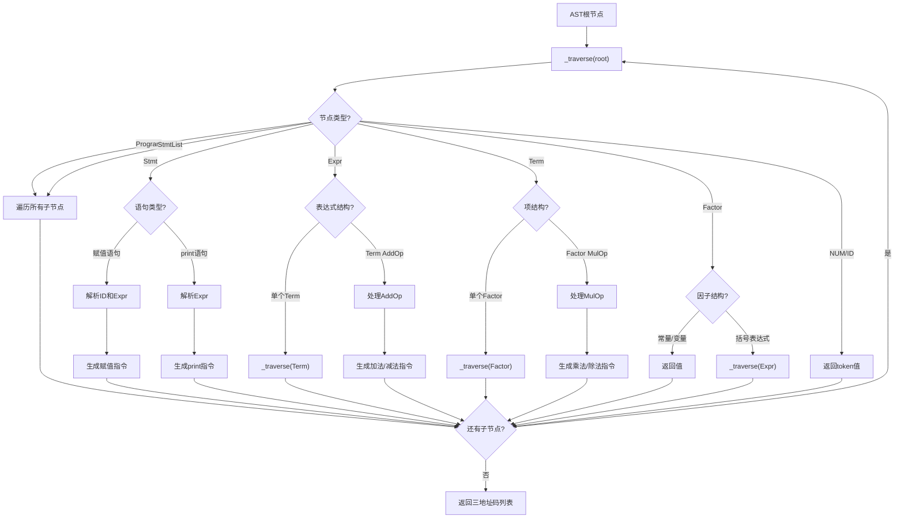

# 自动生成的编译器逻辑流程图

## 1. DFA 处理流程 (词法分析)

```mermaid
flowchart TD
    subgraph "正则表达式到DFA的构建"
        A["正则表达式规则列表"] --> B["RegexParser.parse()"]
        B --> C["生成Regex AST"]
        C --> D["thompson() - Thompson's算法"]
        D --> E["生成NFA片段 (NFAFragment)"]
        E --> F["合并所有NFA"]
        F --> G["nfa_to_dfa() - Subset构造算法"]
        G --> H["生成DFA状态图"]
    end
    
    subgraph "DFA的使用 - 词法分析"
        I["源代码字符串"] --> J["跳过空白和注释"]
        J --> K["从DFA起始状态开始"]
        K --> L["最长匹配扫描"]
        L --> M{"字符在当前状态的转移表中?"}
        M -->|是| N["转移到下一个DFA状态"]
        N --> O{"当前状态是接受状态?"}
        O -->|是| P["记录当前位置和接受状态"]
        O -->|否| Q["继续匹配下一个字符"]
        P --> Q
        Q --> L
        M -->|否| R{"有接受状态记录?"}
        R -->|是| S["生成Token并更新位置"]
        R -->|否| T["词法错误"]
        S --> U{"是否到达文件末尾?"}
        U -->|否| J
        U -->|是| V["添加EOF Token"]
        V --> W["返回Tokens列表"]
    end
    
    H --> K
```

## 2. AST 处理流程 (语法分析)

```mermaid
flowchart TD
    subgraph "语法分析器初始化"
        A["文法规则"] --> B["ParserGenerator.__init__"]
        B --> C["设置文法规则"]
        C --> D["消除左递归"]
        D --> E["计算FIRST集合"]
        E --> F["计算FOLLOW集合"]
        F --> G["生成分析表"]
    end
    
    subgraph "AST的生成 - 递归下降解析"
        H["Tokens列表"] --> I["GeneratedParser.parse()"]
        I --> J["设置当前位置为0"]
        J --> K["从开始符号解析"]
        K --> L["parse_symbol(开始符号)"]
        
        subgraph "parse_symbol(符号)": 处理单个符号
            L --> M{"符号是终结符?"}
            M -->|是| N["match(终结符)"]
            N --> O["返回叶子节点"]
            M -->|否| P{"符号是非终结符?"}
            P -->|是| Q["获取当前Token类型"]
            Q --> R["查找匹配的产生式"]
            R --> S{"找到产生式?"}
            S -->|是| T["创建当前非终结符的AST节点"]
            T --> U["递归解析产生式中的每个符号"]
            U --> V["添加子节点到AST节点"]
            V --> W{"是否解析完所有符号?"}
            W -->|是| X["返回当前AST节点"]
            W -->|否| U
            S -->|否| Y["语法错误"]
        end
        
        X --> Z{"是否到达EOF?"}
        Z -->|是| AA["返回AST根节点"]
        Z -->|否| AB["语法错误"]
    end
    
    subgraph "AST的使用 - 代码生成"
        AA --> AC["CodeGenerator.generate(ast)"]
        AC --> AD["_traverse(ast)"]
        AD --> AE{"节点类型?"}
        AE -->|Program/StmtList| AF["遍历所有子节点"]
        AE -->|Stmt| AG["处理语句(赋值/print)"]
        AE -->|Expr/Term/Factor| AH["处理表达式"]
        AE -->|NUM/ID| AI["返回常量或变量值"]
        AF --> AJ["生成三地址码"]
        AG --> AJ
        AH --> AJ
        AI --> AJ
        AJ --> AK{"是否遍历完所有节点?"}
        AK -->|是| AL["返回三地址码列表"]
        AK -->|否| AD
    end
    
    G --> K
```

## 3. 自动生成的编译器代码结构

```mermaid
flowchart TD
    subgraph "GeneratedCompiler类"
        A["__init__()"] --> B["self.lexer = GeneratedLexer()"]
        A --> C["self.parser = GeneratedParser()"]
        A --> D["self.codegen = CodeGenerator()"]
        E["compile(source_code)"] --> F["调用lexer.tokenize()"]
        E --> G["调用parser.parse()"]
        E --> H["调用codegen.generate()"]
        I["compile_file(input_file, output_file)"] --> J["读取输入文件"]
        J --> E
        E --> K["写入输出文件"]
    end
    
    subgraph "GeneratedLexer类"
        L["__init__()"] --> M["编译正则表达式模式"]
        N["tokenize(text)"] --> O["跳过空白和注释"]
        O --> P["最长匹配扫描"]
        P --> Q["生成Tokens列表"]
    end
    
    subgraph "GeneratedParser类"
        R["__init__()"] --> S["设置文法规则"]
        T["parse(tokens)"] --> U["设置Tokens和位置"]
        U --> V["调用parse_symbol(start_symbol)"]
        W["parse_symbol(symbol)"] --> X["处理终结符/非终结符"]
        X --> Y["构建AST节点"]
    end
    
    subgraph "CodeGenerator类"
        Z["__init__()"] --> AA["初始化临时变量计数器"]
        BB["generate(ast)"] --> CC["调用_traverse(ast)"]
        DD["_traverse(node)"] --> EE["根据节点类型生成代码"]
        EE --> FF["构建三地址码列表"]
    end
    
    B --> F
    C --> G
    D --> H
```

## 4. AST遍历与代码生成的详细流程

```mermaid
flowchart TD
    A["AST根节点"] --> B["_traverse(root)"]
    B --> C{"节点类型?"}
    C -->|Program| D["遍历所有子节点"]
    C -->|StmtList| D
    C -->|Stmt| E{"语句类型?"}
    E -->|赋值语句| F["解析ID和Expr"]
    F --> G["生成赋值指令"]
    E -->|print语句| H["解析Expr"]
    H --> I["生成print指令"]
    C -->|Expr| J{"表达式结构?"}
    J -->|单个Term| K["_traverse(Term)"]
    J -->|Term AddOp| L["处理AddOp"]
    L --> M["生成加法/减法指令"]
    C -->|Term| N{"项结构?"}
    N -->|单个Factor| O["_traverse(Factor)"]
    N -->|Factor MulOp| P["处理MulOp"]
    P --> Q["生成乘法/除法指令"]
    C -->|Factor| R{"因子结构?"}
    R -->|常量/变量| S["返回值"]
    R -->|括号表达式| T["_traverse(Expr)"]
    C -->|NUM/ID| U["返回token值"]
    D --> V{"还有子节点?"}
    G --> V
    I --> V
    K --> V
    M --> V
    O --> V
    Q --> V
    S --> V
    T --> V
    U --> V
    V -->|是| B
    V -->|否| W["返回三地址码列表"]
```
