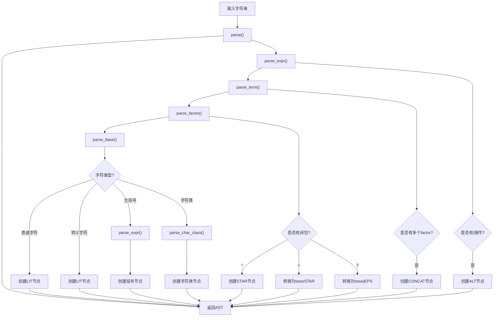
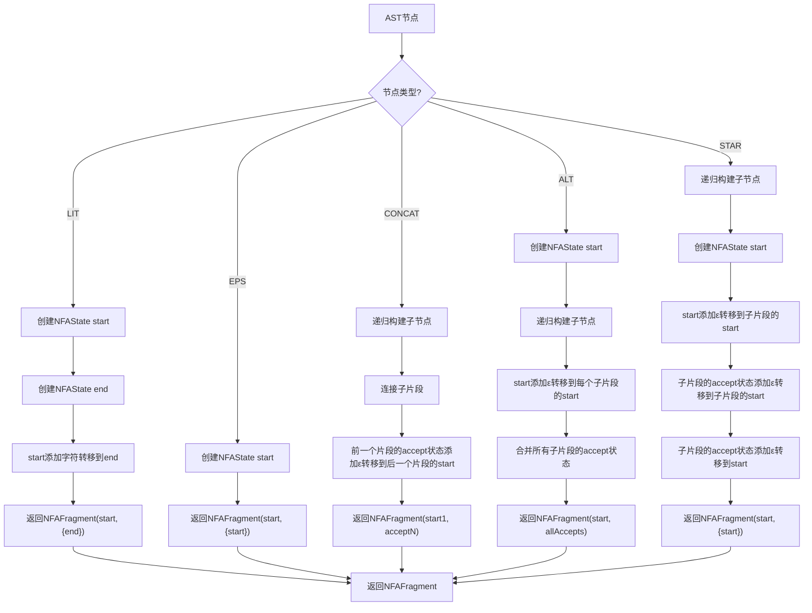
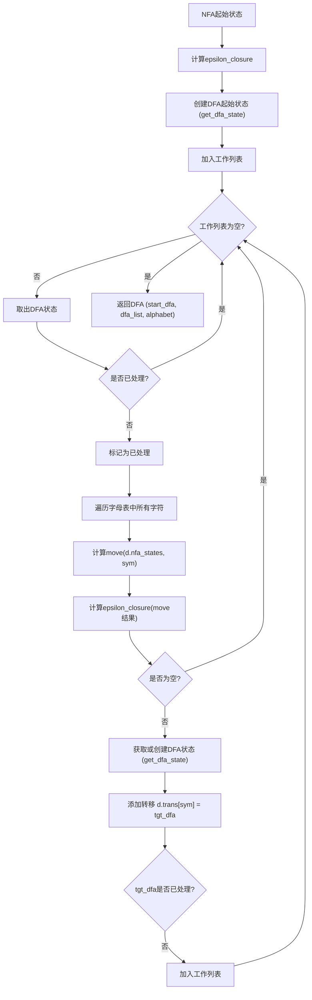
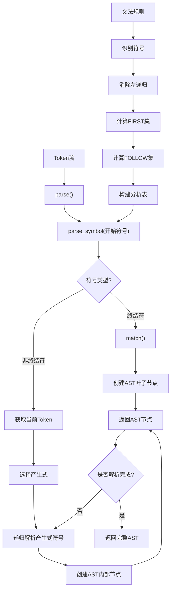
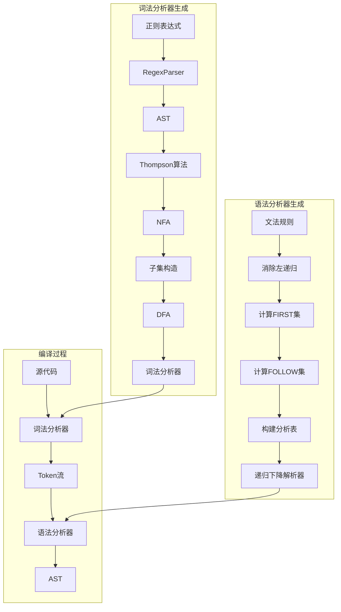

# 编译器生成器核心流程Mermaid图表

## 1. RegexParser的ATS构建流程

```mermaid
flowchart TD
    A["输入字符串"] --> B["parse()"]
    B --> C["parse_expr()"]
    C --> D["parse_term()"]
    D --> E["parse_factor()"]
    E --> F["parse_base()"]
    F --> G1{"字符类型?"}
    G1 -->|"普通字符"| H1["创建LIT节点"]
    G1 -->|"转义字符"| H2["创建LIT节点"]
    G1 -->|"左括号"| H3["parse_expr()"]
    G1 -->|"字符类"| H4["parse_char_class()"]
    H3 --> I["创建括号节点"]
    H4 --> J["创建字符类节点"]
    
    E --> K{"是否有闭包?"}
    K -->|"*"| L1["创建STAR节点"]
    K -->|"+"| L2["转换为baseSTAR"]
    K -->|"?"| L3["转换为base|EPS"]
    
    D --> M{"是否有多个factor?"}
    M -->|"是"| N["创建CONCAT节点"]
    
    C --> O{"是否有|操作?"}
    O -->|"是"| P["创建ALT节点"]
    
    B --> Q["返回AST"]
    
    H1 --> Q
    H2 --> Q
    I --> Q
    J --> Q
    L1 --> Q
    L2 --> Q
    L3 --> Q
    N --> Q
    P --> Q
```

## 2. Thompson算法构建NFA流程

```mermaid
flowchart TD
    A["AST节点"] --> B{"节点类型?"}
    
    B -->|"LIT"| C1["创建NFAState start"]
    C1 --> C2["创建NFAState end"]
    C2 --> C3["start添加字符转移到end"]
    C3 --> C4["返回NFAFragment(start, {end})"]
    
    B -->|"EPS"| D1["创建NFAState start"]
    D1 --> D2["返回NFAFragment(start, {start})"]
    
    B -->|"CONCAT"| E1["递归构建子节点"]
    E1 --> E2["连接子片段"]
    E2 --> E3["前一个片段的accept状态添加ε转移到后一个片段的start"]
    E3 --> E4["返回NFAFragment(start1, acceptN)"]
    
    B -->|"ALT"| F1["创建NFAState start"]
    F1 --> F2["递归构建子节点"]
    F2 --> F3["start添加ε转移到每个子片段的start"]
    F3 --> F4["合并所有子片段的accept状态"]
    F4 --> F5["返回NFAFragment(start, allAccepts)"]
    
    B -->|"STAR"| G1["递归构建子节点"]
    G1 --> G2["创建NFAState start"]
    G2 --> G3["start添加ε转移到子片段的start"]
    G3 --> G4["子片段的accept状态添加ε转移到子片段的start"]
    G4 --> G5["子片段的accept状态添加ε转移到start"]
    G5 --> G6["返回NFAFragment(start, {start})"]
    
    C4 --> H["返回NFAFragment"]
    D2 --> H
    E4 --> H
    F5 --> H
    G6 --> H
```

## 3. NFA到DFA的转换流程

```mermaid
flowchart TD
    A["NFA起始状态"] --> B["计算epsilon_closure"]
    B --> C["创建DFA起始状态 (get_dfa_state)"]
    C --> D["加入工作列表"]
    D --> E{"工作列表为空?"}
    E -->|"否"| F["取出DFA状态"]
    F --> G{"是否已处理?"}
    G -->|"否"| H["标记为已处理"]
    H --> I["遍历字母表中所有字符"]
    I --> J["计算move(d.nfa_states, sym)"]
    J --> K["计算epsilon_closure(move结果)"]
    K --> L{"是否为空?"}
    L -->|"否"| M["获取或创建DFA状态 (get_dfa_state)"]
    M --> N["添加转移 d.trans[sym] = tgt_dfa"]
    N --> O{"tgt_dfa是否已处理?"}
    O -->|"否"| P["加入工作列表"]
    P --> E
    L -->|"是"| E
    G -->|"是"| E
    E -->|"是"| Q["返回DFA (start_dfa, dfa_list, alphabet)"]
```

## 4. 语法分析器关键数据结构转换流程

```mermaid
flowchart TD
    A["文法规则"] --> B["识别符号"]
    B --> C["消除左递归"]
    C --> D["计算FIRST集"]
    D --> E["计算FOLLOW集"]
    E --> F["构建分析表"]
    
    G["Token流"] --> H["parse()"]
    H --> I["parse_symbol(开始符号)"]
    I --> J{"符号类型?"}
    J -->|"终结符"| K["match()"]
    K --> L["创建AST叶子节点"]
    J -->|"非终结符"| M["获取当前Token"]
    M --> N["选择产生式"]
    N --> O["递归解析产生式符号"]
    O --> P["创建AST内部节点"]
    
    L --> Q["返回AST节点"]
    P --> Q
    Q --> R{"是否解析完成?"}
    R -->|"否"| O
    R -->|"是"| S["返回完整AST"]
    
    F --> I
```

## 5. 整体编译器生成器流程

```mermaid
flowchart TD
    subgraph "词法分析器生成"
        A["正则表达式"] --> B["RegexParser"]
        B --> C["AST"]
        C --> D["Thompson算法"]
        D --> E["NFA"]
        E --> F["子集构造"]
        F --> G["DFA"]
        G --> H["词法分析器"]
    end
    
    subgraph "语法分析器生成"
        I["文法规则"] --> J["消除左递归"]
        J --> K["计算FIRST集"]
        K --> L["计算FOLLOW集"]
        L --> M["构建分析表"]
        M --> N["递归下降解析器"]
    end
    
    subgraph "编译过程"
        O["源代码"] --> P["词法分析器"]
        P --> Q["Token流"]
        Q --> R["语法分析器"]
        R --> S["AST"]
    end
    
    H --> P
    N --> R
```