# 编译器-编译器（Compiler-Compiler）程序设计文档

## 目录

1. [项目概述](#1-项目概述)
2. [系统设计](#2-系统设计)
   - [2.1 系统概述](#21-系统概述)
   - [2.2 架构设计](#22-架构设计)
   - [2.3 模块设计](#23-模块设计)
3. [系统实现](#3-系统实现)
   - [3.1 编译器生成器核心逻辑](#31-编译器生成器核心逻辑)
   - [3.2 命令行接口实现](#32-命令行接口实现)
   - [3.3 规则文件解析](#33-规则文件解析)
   - [3.4 错误处理与智能提示](#34-错误处理与智能提示)
4. [系统测试](#4-系统测试)
   - [4.1 测试策略](#41-测试策略)
   - [4.2 测试用例设计](#42-测试用例设计)
   - [4.3 测试结果](#43-测试结果)
5. [AI助手使用](#5-ai助手使用)
6. [附录](#6-附录)
   - [6.1 项目文件结构](#61-项目文件结构)
   - [6.2 关键术语表](#62-关键术语表)
   - [6.3 参考资料](#63-参考资料)
   - [6.4 开发环境配置](#64-开发环境配置)
   - [6.5 常见问题解答（FAQ）](#65-常见问题解答faq)
   - [6.6 项目里程碑](#66-项目里程碑)
   - [6.7 团队分工](#67-团队分工)
   - [6.8 软件使用指南](#68-软件使用指南)

---

## 1. 项目概述

### 1.1 项目简介

本项目是一个**编译器生成器**（Compiler-Compiler），也称为"编译器的编译器"。它能够根据形式化的词法规则和语法规则自动生成完整的编译器，实现从源代码到中间代码的完整编译流程。

### 1.2 核心特性

- **自动化生成**：从规则文件自动生成词法分析器、语法分析器和代码生成器
- **语法制导翻译（SDT）**：在语法分析过程中同时生成中间代码，实现一遍扫描编译
- **模块化设计**：各模块独立实现，便于团队协作和扩展
- **完整的错误处理**：提供友好的错误提示和智能修复建议
- **多语言支持**：通过定义不同的规则文件支持多种语言

### 1.3 技术栈

- **编程语言**：Python 3.x
- **核心算法**：
  - 词法分析：正则表达式 → NFA → DFA
  - 语法分析：LL(1)递归下降解析
  - 代码生成：语法制导翻译（SDT）
- **测试框架**：pytest

---

## 2. 系统设计

### 2.1 系统概述

编译器生成器系统采用**分层架构**设计，主要分为三个层次：

1. **前端层**：负责规则文件解析和命令行接口
2. **生成器层**：负责生成词法分析器、语法分析器和代码生成器
3. **工具层**：提供日志、错误处理等通用功能

系统整体工作流程如下：

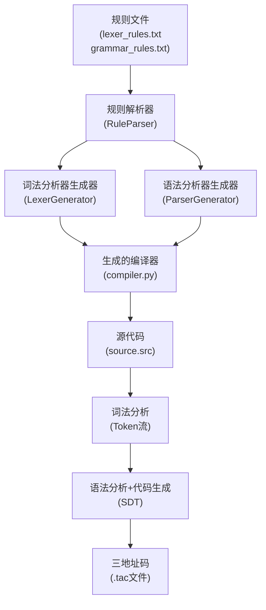

### 2.2 架构设计

#### 2.2.1 系统架构图

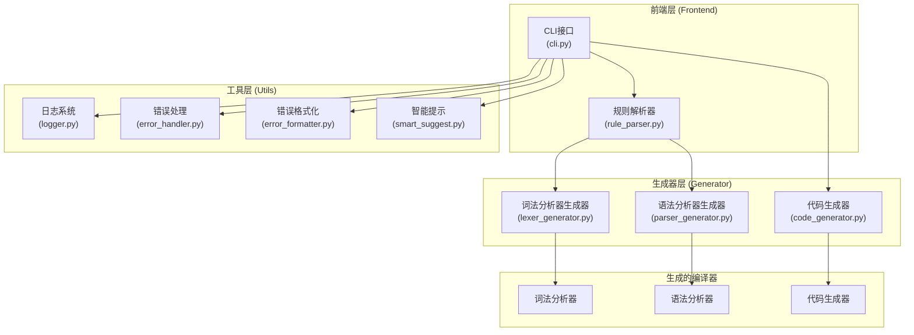

#### 2.2.2 数据流图

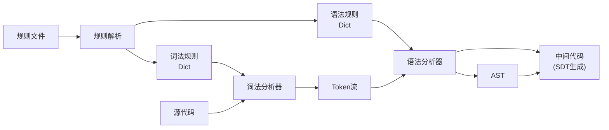

### 2.3 模块设计

#### 2.3.1 模块划分

系统主要包含以下模块：

| 模块 | 文件 | 功能描述 | 负责人 |
|------|------|----------|--------|
| 词法分析器生成器 | `lexer_generator.py` | 从正则表达式规则生成词法分析器 | 同学A |
| 语法分析器生成器 | `parser_generator.py` | 从BNF文法生成语法分析器 | 同学B |
| 代码生成器 | `code_generator.py` | 生成三地址中间代码 | 同学C |
| 规则解析器 | `rule_parser.py` | 解析词法和语法规则文件 | 同学D |
| 命令行接口 | `cli.py` | 提供用户交互接口 | 同学D |
| 工具模块 | `utils/` | 日志、错误处理等通用功能 | 同学D |

#### 2.3.2 核心模块关系图

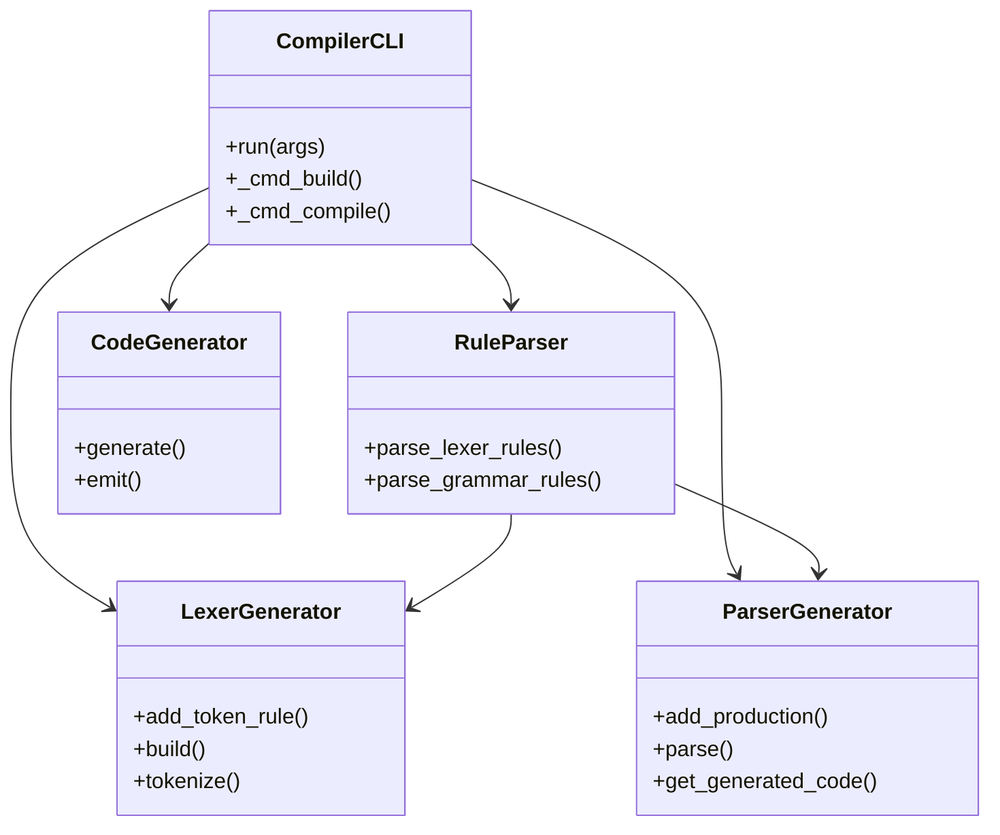

---

## 3. 系统实现

### 3.1 编译器生成器核心逻辑

#### 3.1.1 整体工作流程

编译器生成器的核心逻辑遵循以下步骤：

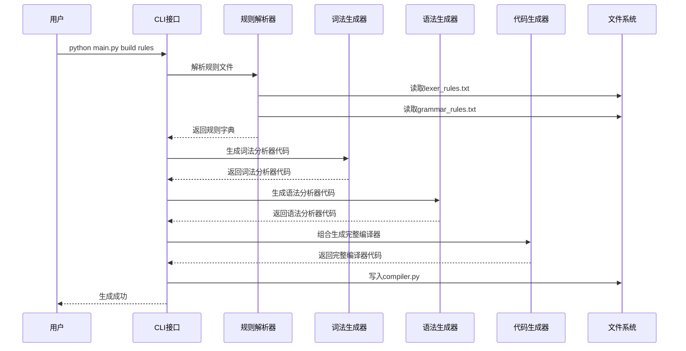

#### 3.1.2 编译流程

当使用生成的编译器编译源代码时，流程如下：

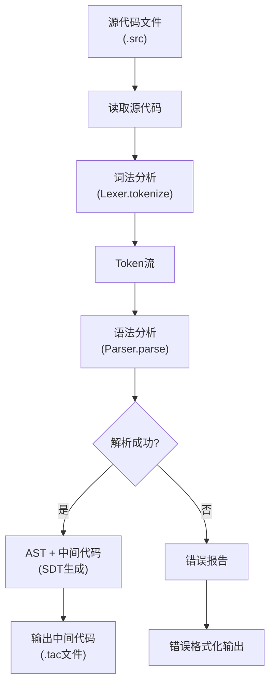

#### 3.1.3 语法制导翻译（SDT）实现逻辑

本项目采用**语法制导翻译**技术，在语法分析过程中同时生成中间代码：

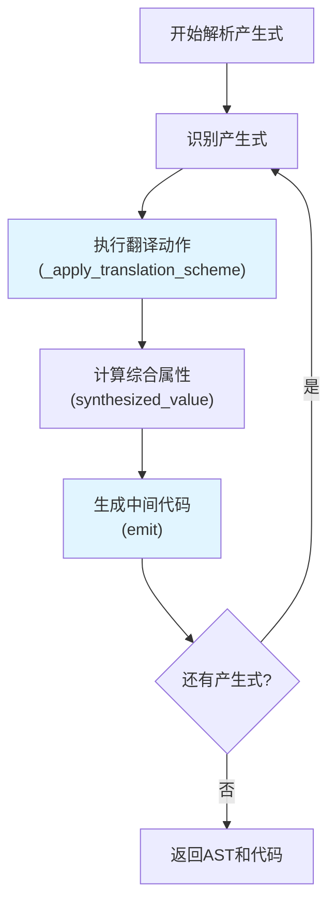

**关键实现点**：
- 每个产生式识别后立即执行翻译动作
- 使用综合属性在AST节点间传递语义信息
- 实时生成三地址码，无需等待整个AST构建完成

> **注意**：语法分析器、词法分析器和三地址码生成的具体实现代码由其他同学负责，此处仅展示整体逻辑。

### 3.2 命令行接口实现

#### 3.2.1 命令结构

系统提供四个主要命令，所有命令都支持最短别名：

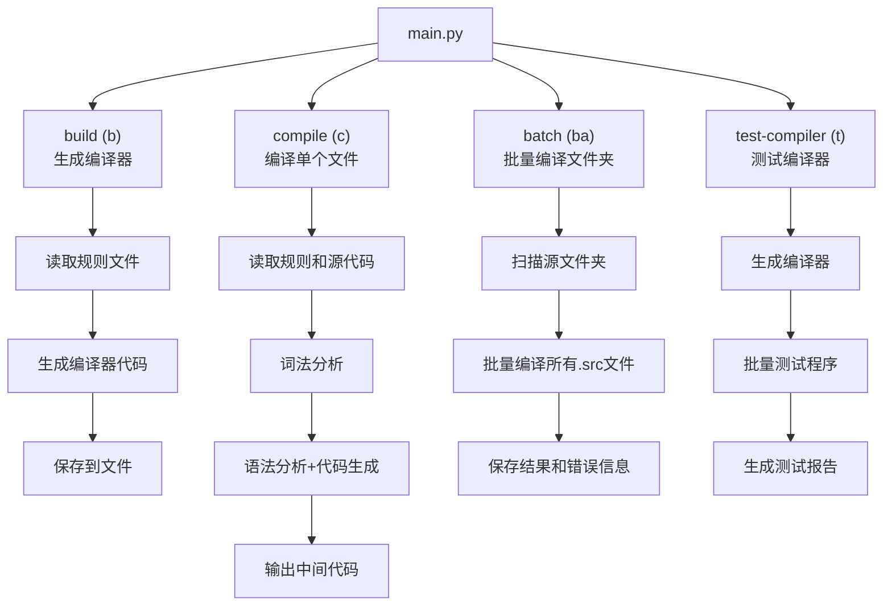

#### 3.2.2 命令使用说明

**配置文件说明**：

所有默认路径都在 `config.py` 中配置，可以随时修改：

```python
# config.py
DEFAULT_COMPILER = "generated/compiler.py"
DEFAULT_SOURCE_DIR = "examples/error_test"
DEFAULT_OUTPUT_DIR = "test_outputs"
DEFAULT_LEXER_RULES = "examples/pl0_subset/lexer_rules.txt"
DEFAULT_GRAMMAR_RULES = "examples/pl0_subset/grammar_rules.txt"
DEFAULT_SOURCE_FILE = "examples/pl0_subset/programs/basic_pl0.src"
```

**1. build 命令（别名：b）：生成编译器**

```bash
# 使用默认规则文件（从 config.py 读取）
python main.py b

# 使用完整命令
python main.py build

# 指定规则文件
python main.py b \
  examples/pl0_subset/lexer_rules.txt \
  examples/pl0_subset/grammar_rules.txt

# 指定输出文件
python main.py b -o generated/my_compiler.py
```

**参数说明**：
- `lexer_rules`：词法规则文件路径（可选，默认从 `config.py` 读取）
- `grammar_rules`：语法规则文件路径（可选，默认从 `config.py` 读取）
- `-o, --output`：输出文件路径（可选，默认从 `config.py` 读取）

**2. compile 命令（别名：c）：编译单个文件**

```bash
# 使用默认配置（从 config.py 读取）
python main.py c

# 使用完整命令
python main.py compile

# 指定文件
python main.py c examples/simple_expr/programs/basic_sample.src -o output.tac

# 完整命令（指定所有参数）
python main.py compile \
  examples/simple_expr/lexer_rules.txt \
  examples/simple_expr/grammar_rules.txt \
  examples/simple_expr/programs/basic_sample.src \
  -o output.tac
```

**参数说明**：
- `lexer_rules`：词法规则文件路径（可选，默认从 `config.py` 读取）
- `grammar_rules`：语法规则文件路径（可选，默认从 `config.py` 读取）
- `source`：源代码文件路径（可选，默认从 `config.py` 读取）
- `-o, --output`：输出文件路径（可选，不指定则输出到控制台）

**3. batch 命令（别名：ba）：批量编译文件夹**

```bash
# 使用默认配置（从 config.py 读取）
python main.py ba

# 使用完整命令
python main.py batch

# 指定源文件夹和输出文件夹
python main.py ba examples/error_test test_outputs/errors

# 指定所有参数
python main.py ba examples/error_test test_outputs/errors -c generated/compiler.py
```

**参数说明**：
- `source_dir`：源文件夹路径（可选，默认从 `config.py` 读取 `DEFAULT_SOURCE_DIR`）
- `output_dir`：输出文件夹路径（可选，默认从 `config.py` 读取 `DEFAULT_OUTPUT_DIR`）
- `-c, --compiler`：编译器路径（可选，默认从 `config.py` 读取 `DEFAULT_COMPILER`）

**批量编译功能特点**：
- **递归搜索**：自动搜索子文件夹中的所有 `.src` 文件
- **保持目录结构**：输出文件保持与源文件相同的目录结构
- **错误处理**：编译失败时保存详细的错误信息（英文格式）到 `_error.txt` 文件
- **统计信息**：显示编译统计（成功/失败数量）

**输出说明**：
- **编译成功**：保存为 `<output_dir>/<filename>.tac`
- **编译失败**：保存错误信息到 `<output_dir>/<filename>_error.txt`

**4. test-compiler 命令（别名：t）：批量测试**

```bash
# 使用默认配置（从 config.py 读取）
python main.py t

# 使用完整命令
python main.py test-compiler

# 指定测试目录
python main.py t -p examples/simple_expr/programs -o test_outputs
```

**参数说明**：
- `-c, --compiler-output`：生成的编译器路径（可选，默认从 `config.py` 读取）
- `-p, --program-dir`：测试程序目录（可选，默认从 `config.py` 读取）
- `-o, --output-dir`：测试输出目录（可选，默认从 `config.py` 读取）

#### 3.2.3 CLI实现关键代码

CLI模块的核心实现位于 `src/frontend/cli.py`，主要类为 `CompilerCLI`。关键方法包括：

```python
class CompilerCLI:
    """编译器CLI类"""
    
    def run(self, args: list = None) -> int:
        """运行CLI程序的主入口点"""
        # 解析命令行参数
        # 根据命令类型调用相应处理方法
        # 返回退出码
    
    def _cmd_build(self, args) -> int:
        """处理 build 命令：生成编译器"""
        # 1. 加载规则文件
        # 2. 生成词法分析器代码
        # 3. 生成语法分析器代码
        # 4. 组合生成完整编译器
        # 5. 保存到文件
    
    def _cmd_compile(self, args) -> int:
        """处理 compile 命令：编译源代码"""
        # 1. 加载规则和源代码
        # 2. 词法分析
        # 3. 语法分析+代码生成（SDT）
        # 4. 输出中间代码
        # 5. 可选：生成控制流图
```

> **注意**：具体实现代码由团队共同完成，此处仅展示接口设计。

### 3.3 规则文件解析

#### 3.3.1 规则文件格式

**词法规则文件格式** (`lexer_rules.txt`)：

```
# 格式: TOKEN_TYPE = regex_pattern
# 支持标准的正则表达式语法

# 关键字（必须放在ID之前）
PRINT = print

# 标识符
ID = [a-zA-Z_][a-zA-Z0-9_]*

# 数字（整数和浮点数）
NUM = [0-9]+(?:\.[0-9]+)?

# 算术运算符
PLUS = \+
MINUS = -
MUL = \*
DIV = /

# 赋值号
ASSIGN = =

# 括号
LPAREN = \(
RPAREN = \)

# 分号
SEMI = ;
```

**语法规则文件格式** (`grammar_rules.txt`)：

```
# 格式: NonTerminal -> production1 | production2
# 使用BNF表示法
# 终结符用单引号括起来，非终结符不加引号

Program -> StmtList
StmtList -> Stmt StmtList | Stmt
Stmt -> 'ID' 'ASSIGN' Expr 'SEMI' | 'PRINT' 'LPAREN' Expr 'RPAREN' 'SEMI'
Expr -> Term AddOp | Term
AddOp -> 'PLUS' Term AddOp | 'MINUS' Term AddOp | 'PLUS' Term | 'MINUS' Term
Term -> Factor MulOp | Factor
MulOp -> 'MUL' Factor MulOp | 'DIV' Factor MulOp | 'MUL' Factor | 'DIV' Factor
Factor -> 'NUM' | 'ID' | 'LPAREN' Expr 'RPAREN'
```

#### 3.3.2 规则解析流程

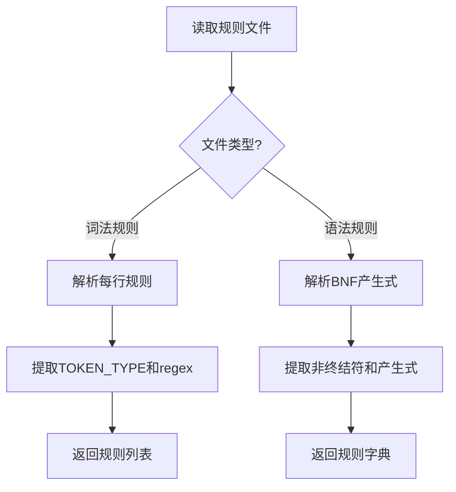

#### 3.3.3 规则解析器实现

规则解析器 `RuleParser` 提供两个静态方法：

```python
class RuleParser:
    """规则文件解析器"""
    
    @staticmethod
    def parse_lexer_rules(filename: str) -> List[Tuple[str, str]]:
        """解析词法规则文件
        
        返回: [(token_type, regex_pattern), ...]
        """
        # 1. 读取文件
        # 2. 跳过注释和空行
        # 3. 解析 "TOKEN_TYPE = pattern" 格式
        # 4. 返回规则列表
    
    @staticmethod
    def parse_grammar_rules(filename: str) -> Dict[str, List[List[str]]]:
        """解析语法规则文件
        
        返回: {nonterminal: [[production1], [production2], ...]}
        """
        # 1. 读取文件
        # 2. 解析 "NonTerminal -> symbol1 symbol2 | symbol3" 格式
        # 3. 处理终结符（单引号）和非终结符
        # 4. 返回规则字典
```

### 3.4 错误处理与智能提示

#### 3.4.1 错误处理流程

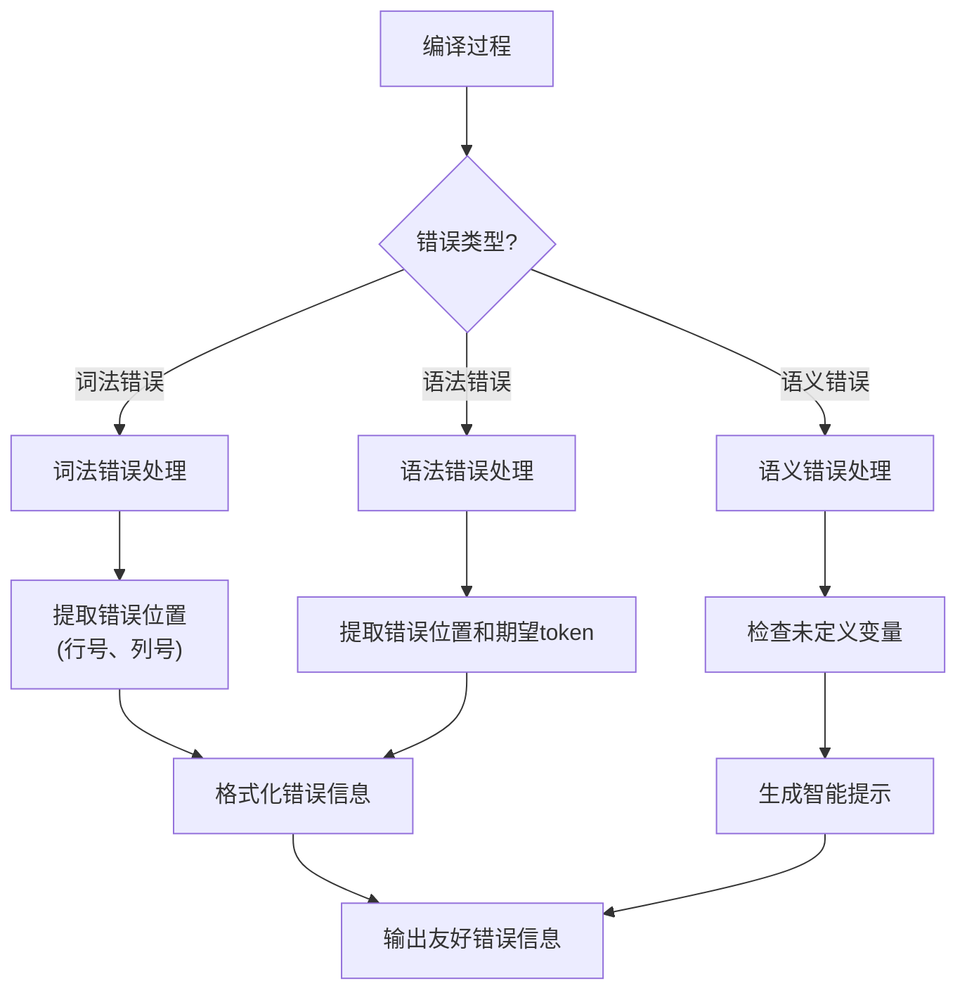

#### 3.4.2 错误格式化示例

系统提供友好的错误提示，包括：

- **位置信息**：精确到行号和列号
- **上下文显示**：显示错误附近的源代码
- **期望提示**：语法错误时提示期望的token
- **智能建议**：变量拼写错误时提供修复建议

**错误输出示例**：

```
语法错误: 第 3 行, 第 5 列
期望: ID, NUM, LPAREN

  1 | x = 10;
  2 | y = 20;
  3 | print(x + );
     |      ^
  4 | 
```

#### 3.4.3 智能提示功能

系统实现了基于编辑距离的变量拼写错误检测和修复建议：

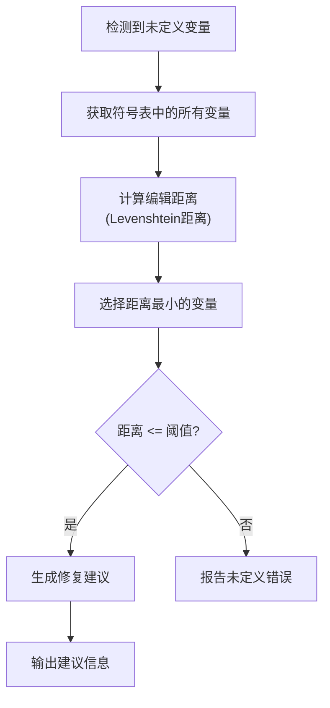

---

## 4. 系统测试

### 4.1 测试策略

#### 4.1.1 测试层次

系统采用**三层测试策略**：

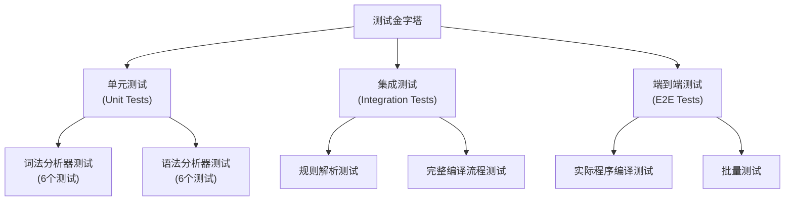

#### 4.1.2 测试覆盖

- **单元测试**：覆盖核心模块的各个功能点
- **集成测试**：验证模块间的协作
- **端到端测试**：验证完整编译流程

### 4.2 测试用例设计

#### 4.2.1 词法分析器测试

**测试文件**：`tests/test_lexer.py`

| 测试用例 | 测试内容 | 预期结果 |
|---------|---------|---------|
| `test_add_token_rule` | 添加词法规则 | 规则成功添加 |
| `test_build_lexer` | 构建词法分析器 | 分析器构建成功 |
| `test_tokenize_simple` | 简单词法分析 | 正确识别token |
| `test_tokenize_with_whitespace` | 空白符处理 | 正确跳过空白符 |
| `test_tokenize_error` | 错误处理 | 正确报告词法错误 |
| `test_line_column_tracking` | 位置追踪 | 正确记录行号和列号 |

**测试程序示例**：

```python
def test_tokenize_simple():
    """测试简单词法分析"""
    lexer = LexerGenerator()
    lexer.add_token_rule('NUM', r'[0-9]+')
    lexer.add_token_rule('PLUS', r'\+')
    lexer.build()
    
    tokens = lexer.tokenize("1 + 2")
    assert len(tokens) == 4  # NUM, PLUS, NUM, EOF
    assert tokens[0].type == 'NUM'
    assert tokens[0].value == '1'
```

#### 4.2.2 语法分析器测试

**测试文件**：`tests/test_parser.py`

| 测试用例 | 测试内容 | 预期结果 |
|---------|---------|---------|
| `test_create_parser` | 创建解析器 | 解析器创建成功 |
| `test_add_production` | 添加产生式 | 产生式成功添加 |
| `test_parse_simple` | 简单解析 | 正确构建AST |
| `test_parse_with_alternatives` | 产生式选择 | 正确选择产生式 |
| `test_parse_error` | 语法错误 | 正确报告语法错误 |
| `test_ast_node_creation` | AST节点 | 正确创建AST节点 |

#### 4.2.3 集成测试

**测试文件**：`tests/test_integration.py`

| 测试用例 | 测试内容 | 预期结果 |
|---------|---------|---------|
| `test_end_to_end` | 完整编译流程 | 从规则文件到代码生成成功 |
| `test_rule_parser` | 规则解析 | 正确解析规则文件 |

#### 4.2.4 测试程序设计

系统提供了多个测试程序，覆盖不同的语法特性：

**1. 简单表达式语言测试程序**

| 程序文件 | 描述 | 测试重点 |
|---------|------|---------|
| `basic_sample.src` | 基础示例 | 赋值、打印、简单表达式 |
| `complex_arith.src` | 复杂算术 | 运算符优先级、括号 |
| `mixed_prints.src` | 混合打印 | 多个打印语句 |

**示例程序：`basic_sample.src`**

```c
// 基础示例
x = 10;
y = 20;
print(x + y);
```

**示例程序：`complex_arith.src`**

```c
// 复杂算术示例
a = 1 + 2 * 3;
b = (a - 4) / 2;
c = a * b + 5 - (3 / 1);
print(a + b + c);
```

**2. PL/0子集语言测试程序**

| 程序文件 | 描述 | 测试重点 |
|---------|------|---------|
| `basic_pl0.src` | 基础PL/0程序 | PL/0基本语法 |
| `if_while_pl0.src` | 控制流 | if语句、while循环 |
| `mixed_pl0.src` | 混合特性 | 综合测试 |

**3. 错误测试程序**

系统还提供了专门的错误测试程序，用于验证错误处理：

| 程序文件 | 错误类型 | 测试内容 |
|---------|---------|---------|
| `error_test.src` | 语法错误 | 缺少分号、括号不匹配等 |
| `error_undefined_var.src` | 语义错误 | 未定义变量 |
| `smart_suggest_demo1.src` | 智能提示 | 变量拼写错误 |

### 4.3 测试结果

#### 4.3.1 测试统计

运行测试命令：

```bash
python -m pytest tests/ -v
```

**测试结果统计**：

| 测试模块 | 测试数量 | 通过数量 | 状态 |
|---------|---------|---------|------|
| 词法分析器 | 6 | 6 | 全部通过 |
| 语法分析器 | 6 | 6 | 全部通过 |
| 集成测试 | 2 | 2 | 全部通过 |
| **总计** | **14** | **14** | **全部通过** |

#### 4.3.2 测试输出示例

```
tests/test_lexer.py::TestLexerGenerator::test_add_token_rule PASSED
tests/test_lexer.py::TestLexerGenerator::test_build_lexer PASSED
tests/test_lexer.py::TestLexerGenerator::test_tokenize_simple PASSED
tests/test_lexer.py::TestLexerGenerator::test_tokenize_with_whitespace PASSED
tests/test_lexer.py::TestLexerGenerator::test_tokenize_error PASSED
tests/test_lexer.py::TestLexerGenerator::test_line_column_tracking PASSED
tests/test_parser.py::TestParserGenerator::test_create_parser PASSED
tests/test_parser.py::TestParserGenerator::test_add_production PASSED
tests/test_parser.py::TestParserGenerator::test_parse_simple PASSED
tests/test_parser.py::TestParserGenerator::test_parse_with_alternatives PASSED
tests/test_parser.py::TestParserGenerator::test_parse_error PASSED
tests/test_parser.py::TestParserGenerator::test_ast_node_creation PASSED
tests/test_integration.py::TestIntegration::test_end_to_end PASSED
tests/test_integration.py::TestIntegration::test_rule_parser PASSED

======================== 14 passed in X.XXs ========================
```

#### 4.3.3 实际编译测试结果

**测试程序1：`basic_sample.src`**

源代码：
```c
// 基础示例
x = 10;
y = 20;
print(x + y);
```

生成的中间代码：
```
x = 10
y = 20
t1 = x + y
param t1
call print, 1
```

**测试程序2：`complex_arith.src`**

源代码：
```c
// 复杂算术示例
a = 1 + 2 * 3;
b = (a - 4) / 2;
c = a * b + 5 - (3 / 1);
print(a + b + c);
```

生成的中间代码：
```
a = 1
t1 = 2 * 3
a = a + t1
t2 = a - 4
b = t2 / 2
t3 = a * b
t4 = 3 / 1
t5 = t3 + 5
c = t5 - t4
t6 = a + b
t7 = t6 + c
param t7
call print, 1
```

**测试程序3：错误处理测试**

测试语法错误处理：
```c
x = 10;
y = 20;
print(x + );  // 语法错误：缺少操作数
```

错误输出：
```
语法错误: 第 3 行, 第 12 列
期望: ID, NUM, LPAREN

  1 | x = 10;
  2 | y = 20;
  3 | print(x + );
     |            ^
  4 | 
```

---

## 5. AI助手使用

### 5.1 AI助手在项目开发中的作用

本项目在开发过程中充分利用了AI助手（如Cursor、GitHub Copilot等）来提高开发效率和代码质量。AI助手在以下方面发挥了重要作用：

#### 5.1.1 代码生成与补全

- **快速生成模板代码**：根据函数签名和注释自动生成函数体框架
- **智能代码补全**：根据上下文自动补全变量名、函数调用等
- **重构建议**：提供代码重构和优化的建议

#### 5.1.2 错误诊断与修复

- **错误定位**：快速定位语法错误、类型错误等
- **修复建议**：提供具体的修复方案和代码示例
- **代码审查**：检查代码风格和潜在问题

#### 5.1.3 文档生成

- **注释生成**：根据代码自动生成函数和类的文档字符串
- **README编写**：协助编写项目文档和使用说明
- **设计文档**：帮助整理和格式化设计文档


## 6. 附录

### 6.1 项目文件结构

```
Compiler-Principles-Project/
├── docs/                          # 项目文档
│   ├── 软件设计文档.md            # 本文档
│   ├── QUICKSTART.md              # 快速开始指南
│   ├── SDT实现说明.md             # 语法制导翻译实现说明
│   └── 测试报告.md                # 测试报告
├── src/                           # 源代码
│   ├── compiler_generator/        # 编译器生成器核心
│   │   ├── lexer_generator.py     # 词法分析器生成器
│   │   ├── parser_generator.py    # 语法分析器生成器
│   │   └── code_generator.py      # 代码生成器
│   ├── frontend/                  # 前端接口
│   │   ├── cli.py                 # 命令行接口
│   │   └── rule_parser.py         # 规则解析器
│   └── utils/                     # 工具模块
│       ├── logger.py              # 日志系统
│       ├── error_handler.py       # 错误处理
│       ├── error_formatter.py     # 错误格式化
│       └── smart_suggest.py       # 智能提示
├── examples/                      # 示例语言定义
│   ├── simple_expr/               # 简单表达式语言
│   │   ├── lexer_rules.txt        # 词法规则
│   │   ├── grammar_rules.txt      # 语法规则
│   │   └── programs/              # 测试程序
│   └── pl0_subset/                # PL/0子集语言
│       ├── lexer_rules.txt
│       ├── grammar_rules.txt
│       └── programs/
├── generated/                     # 生成的编译器
│   ├── compiler.py                # 生成的编译器
│   └── compiler_simple.py        # 简单表达式编译器
├── tests/                         # 测试文件
│   ├── test_lexer.py              # 词法分析器测试
│   ├── test_parser.py              # 语法分析器测试
│   └── test_integration.py        # 集成测试
├── test_outputs/                  # 测试输出
├── main.py                        # 主程序入口
├── config.py                      # 配置文件（默认路径参数）
├── requirements.txt               # 项目依赖
└── README.md                      # 项目说明
```

### 6.2 关键术语表

| 术语 | 英文 | 说明 |
|------|------|------|
| 编译器生成器 | Compiler-Compiler | 能够根据规则文件自动生成编译器的工具 |
| 词法分析 | Lexical Analysis | 将源代码转换为token流的过程 |
| 语法分析 | Syntax Analysis | 根据语法规则构建抽象语法树的过程 |
| 语法制导翻译 | Syntax-Directed Translation (SDT) | 在语法分析过程中同时生成中间代码的技术 |
| 三地址码 | Three-Address Code | 一种中间代码表示形式 |
| 抽象语法树 | Abstract Syntax Tree (AST) | 表示程序语法结构的树形数据结构 |
| 产生式 | Production | 文法规则，定义如何从非终结符推导出符号序列 |
| 非终结符 | Non-terminal | 文法中可以进一步展开的符号 |
| 终结符 | Terminal | 文法中的基本符号，不能再展开 |
| FIRST集合 | FIRST Set | 从某个符号开始可以推导出的第一个终结符集合 |
| FOLLOW集合 | FOLLOW Set | 某个非终结符后面可能出现的终结符集合 |

### 6.3 参考资料

1. **编译原理教材**
   - 《编译原理》（龙书）- Aho, Lam, Sethi, Ullman
   - 《现代编译原理》- Andrew W. Appel

2. **相关工具**
   - [ANTLR](https://www.antlr.org/) - 语法分析器生成器
   - [Lex/Yacc](https://en.wikipedia.org/wiki/Yacc) - 经典的词法和语法分析器生成器
   - [PLY](https://www.dabeaz.com/ply/) - Python的Lex/Yacc实现

3. **在线资源**
   - [正则表达式教程](https://regex101.com/)
   - [BNF范式说明](https://en.wikipedia.org/wiki/Backus%E2%80%93Naur_form)
   - [语法制导翻译](https://en.wikipedia.org/wiki/Syntax-directed_translation)

### 6.4 开发环境配置

#### 6.4.1 环境要求

- **Python版本**：Python 3.7+
- **操作系统**：Windows / Linux / macOS
- **依赖包**：见 `requirements.txt`

#### 6.4.2 安装步骤

```bash
# 1. 克隆项目（如果使用Git）
git clone <repository-url>
cd Compiler-Principles-Project

# 2. 创建虚拟环境（推荐）
python -m venv venv
source venv/bin/activate  # Linux/macOS
# 或
venv\Scripts\activate  # Windows

# 3. 安装依赖
pip install -r requirements.txt

# 4. 运行测试
python -m pytest tests/ -v
```

#### 6.4.3 开发工具推荐

- **IDE**：VS Code、PyCharm
- **AI助手**：Cursor、GitHub Copilot
- **版本控制**：Git
- **测试框架**：pytest

### 6.5 常见问题解答（FAQ）

**Q1: 如何添加新的语言支持？**

A: 创建新的规则文件目录，编写 `lexer_rules.txt` 和 `grammar_rules.txt`，然后使用 `build` 命令生成编译器。

**Q2: 生成的编译器如何使用？**

A: 使用 `python generated/compiler.py <source_file> -o <output_file>` 命令编译源代码。

**Q3: 如何调试规则文件中的错误？**

A: 检查正则表达式语法，确保BNF格式正确，使用测试程序逐步验证。

**Q4: 支持哪些语法特性？**

A: 支持表达式、赋值、打印、条件语句、循环等，具体取决于语法规则文件的定义。

**Q5: 如何扩展代码生成功能？**

A: 修改 `code_generator.py` 中的代码生成逻辑，或修改 `parser_generator.py` 中的SDT翻译动作。

### 6.6 项目里程碑

| 时间 | 里程碑 | 说明 |
|------|--------|------|
| 第1周 | 项目启动 | 确定需求，设计架构 |
| 第2周 | 词法分析器 | 完成词法分析器生成器 |
| 第3周 | 语法分析器 | 完成语法分析器生成器 |
| 第4周 | 代码生成器 | 完成代码生成器，实现SDT |
| 第5周 | 集成测试 | 完成集成测试，修复bug |
| 第6周 | 文档完善 | 完成文档编写，项目总结 |

### 6.7 团队分工

| 成员 | 负责模块 | 主要工作 |
|------|---------|---------|
| 同学A | 词法分析器生成器 | 实现正则表达式到DFA的转换 |
| 同学B | 语法分析器生成器 | 实现LL(1)解析和SDT |
| 同学C | 代码生成器 | 实现三地址码生成 |
| 同学D | 前端接口、工具模块、测试、文档 | CLI、规则解析、错误处理、批量编译、测试用例、文档编写等 |

### 6.8 软件使用指南

#### 6.8.1 快速开始

**1. 环境准备**

```bash
# 安装依赖
pip install -r requirements.txt
```

**2. 配置文件说明**

编辑 `config.py` 文件可以修改所有默认路径：

```python
# config.py
DEFAULT_COMPILER = "generated/compiler.py"          # 默认生成的编译器路径
DEFAULT_SOURCE_DIR = "examples/error_test"          # 默认源文件夹
DEFAULT_OUTPUT_DIR = "test_outputs"                 # 默认输出文件夹
DEFAULT_LEXER_RULES = "examples/pl0_subset/lexer_rules.txt"      # 默认词法规则
DEFAULT_GRAMMAR_RULES = "examples/pl0_subset/grammar_rules.txt" # 默认语法规则
DEFAULT_SOURCE_FILE = "examples/pl0_subset/programs/basic_pl0.src" # 默认源文件
```

#### 6.8.2 命令详解

**命令别名对照表**：

| 完整命令 | 简化命令 | 功能说明 |
|---------|---------|---------|
| `build` | `b` | 从规则文件生成编译器 |
| `compile` | `c` | 编译单个源代码文件 |
| `batch` | `ba` | 批量编译文件夹中的所有 `.src` 文件 |
| `test-compiler` | `t` | 批量测试生成的编译器 |

**1. 生成编译器**

```bash
# 方式1：使用默认配置（最短命令）
python main.py b

# 方式2：指定规则文件
python main.py b examples/pl0_subset/lexer_rules.txt examples/pl0_subset/grammar_rules.txt

# 方式3：指定输出文件
python main.py b -o generated/my_compiler.py

# 方式4：完整命令
python main.py build \
  examples/pl0_subset/lexer_rules.txt \
  examples/pl0_subset/grammar_rules.txt \
  -o generated/compiler_pl0.py
```

**2. 编译单个文件**

```bash
# 方式1：使用默认配置（最短命令）
python main.py c

# 方式2：指定源文件
python main.py c examples/simple_expr/programs/basic_sample.src -o output.tac

# 方式3：完整命令
python main.py compile \
  examples/simple_expr/lexer_rules.txt \
  examples/simple_expr/grammar_rules.txt \
  examples/simple_expr/programs/basic_sample.src \
  -o output.tac
```

**3. 批量编译（推荐用于测试）**

```bash
# 方式1：使用默认配置（最短命令）
python main.py ba

# 方式2：指定源文件夹和输出文件夹
python main.py ba examples/error_test test_outputs/errors

# 方式3：指定所有参数
python main.py ba examples/error_test test_outputs/errors -c generated/compiler.py

# 方式4：完整命令
python main.py batch \
  examples/error_test \
  test_outputs/errors \
  -c generated/compiler.py
```

**批量编译输出说明**：
- 编译成功：生成 `<filename>.tac` 文件
- 编译失败：生成 `<filename>_error.txt` 文件，包含详细错误信息（英文格式）

**4. 测试编译器**

```bash
# 方式1：使用默认配置（最短命令）
python main.py t

# 方式2：指定测试目录
python main.py t -p examples/simple_expr/programs -o test_outputs

# 方式3：完整命令
python main.py test-compiler \
  examples/simple_expr/lexer_rules.txt \
  examples/simple_expr/grammar_rules.txt \
  -p examples/simple_expr/programs \
  -o test_outputs
```

#### 6.8.3 典型使用场景

**场景1：快速测试新语言规则**

```bash
# 1. 编辑规则文件
# examples/my_lang/lexer_rules.txt
# examples/my_lang/grammar_rules.txt

# 2. 生成编译器
python main.py b examples/my_lang/lexer_rules.txt examples/my_lang/grammar_rules.txt

# 3. 测试单个文件
python main.py c examples/my_lang/test.src -o test.tac
```

**场景2：批量测试错误处理**

```bash
# 1. 准备错误测试文件（放在 examples/error_test/ 目录）
# error1.src, error2.src, ...

# 2. 批量编译并查看错误信息
python main.py ba examples/error_test test_outputs/errors

# 3. 查看错误文件
# test_outputs/errors/error1_error.txt
# test_outputs/errors/error2_error.txt
```

**场景3：完整编译流程**

```bash
# 1. 生成编译器
python main.py b examples/pl0_subset/lexer_rules.txt examples/pl0_subset/grammar_rules.txt

# 2. 批量编译所有程序
python main.py ba examples/pl0_subset/programs test_outputs/pl0_programs

# 3. 查看编译结果
ls test_outputs/pl0_programs/*.tac
```

#### 6.8.4 错误信息说明

所有错误信息使用英文格式，避免编码问题。错误信息包含：

1. **错误类型**：Syntax Error（语法错误）或 Lexical Error（词法错误）
2. **错误位置**：文件路径、行号、列号
3. **源代码片段**：显示错误前后各2行代码
4. **错误详情**：具体错误描述
5. **修复建议**：智能建议可能的修复方法

**示例错误输出**：

```
======================================================================
[ERROR] Syntax Error
======================================================================

[Location] File: test.src, Line 3, Column 12

[Source Code Snippet]:
----------------------------------------------------------------------
       1 | x = 10;
       2 | y = 20;
>>>    3 | print(x + );  // Missing operand
            ^
       4 | 
----------------------------------------------------------------------

[Error Details]:
   Syntax error at line 3, column 12
  Expected: ID, NUM, LPAREN

[Suggestions]:
   - Please check if the grammar rules are correct
   - Make sure no necessary symbols are missing
======================================================================
```

#### 6.8.5 常见问题

**Q1: 如何修改默认配置？**

A: 直接编辑 `config.py` 文件，修改相应的默认路径即可。

**Q2: 批量编译时如何只编译特定文件？**

A: 批量编译会编译文件夹中所有 `.src` 文件。如需选择性编译，可以：
- 将需要编译的文件放在单独文件夹
- 或使用 `compile` 命令逐个编译

**Q3: 生成的编译器如何使用？**

A: 生成的编译器是一个独立的 Python 脚本，可以直接运行：

```bash
python generated/compiler.py source.src -o output.tac
```

**Q4: 如何查看命令帮助？**

A: 使用 `--help` 参数：

```bash
python main.py --help
python main.py b --help
python main.py ba --help
```

