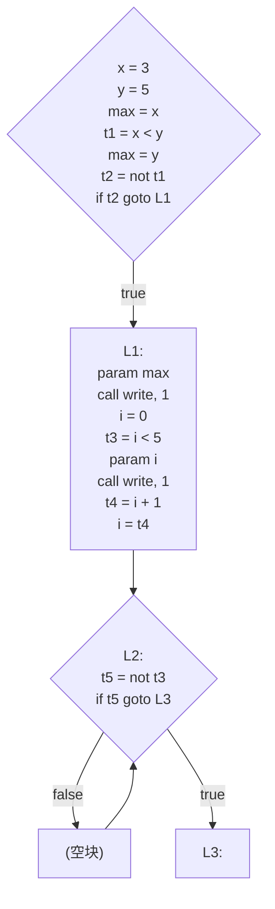

# 控制流图

```mermaid
graph TD
    B0{"x = 3\ny = 5\nmax = x\nt1 = x < y\nmax = y\nt2 = not t1\nif t2 goto L1"}
    B1["L1:\nparam max\ncall write, 1\ni = 0\nt3 = i < 5\nparam i\ncall write, 1\nt4 = i + 1\ni = t4"]
    B2{"L2:\nt5 = not t3\nif t5 goto L3"}
    B3["(空块)"]
    B4["L3:"]
    B0 -->|true| B1
    B1 --> B2
    B2 -->|false| B3
    B2 -->|true| B4
    B3 --> B2
```
